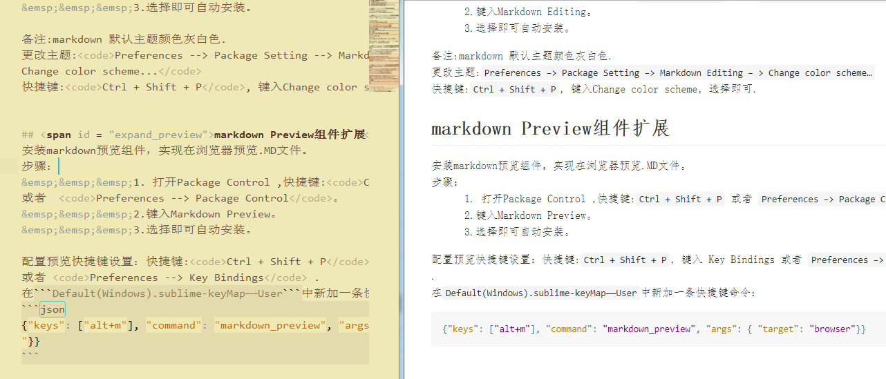

# 使用sublime 编辑markdown
1. [下载sublime](#down_sublime)
2. [安装sublime package control](#install_package_control)
3. [markdown Editing组件扩展](#expand_editing)
4. [markdown Preview组件扩展](#expand_preview)
5. [即时编辑预览效果](#ontime_editor_preview)

## <span id = "down_sublime">下载sublime</span>
下载地址:<a href="http://www.sublimetext.com" target="_blank" title="Sublime Text3 官网">Sublime Text3 官网</a>
按照安装步骤，完成Sublime Text3的安装程序。

## <span id = "install_package_control">安装sublime package control</span>
安装Package Control：<a href="https://packagecontrol.io/installation" target="_blank" title="Package Control">Package Control</a>

```javascript
import urllib.request,os,hashlib;
h = 'df21e130d211cfc94d9b0905775a7c0f' + '1e3d39e33b79698005270310898eea76';
pf = 'Package Control.sublime-package';
ipp = sublime.installed_packages_path();
urllib.request.install_opener(urllib.request.build_opener(urllib.request.ProxyHandler()));
by = urllib.request.urlopen('http://packagecontrol.io/' + pf.replace(' ', '%20')).read();
dh = hashlib.sha256(by).hexdigest();
print('Error validating download (got %s instead of %s), please try manual install' % (dh, h)) 
if dh != h
else open(os.path.join(ipp, pf), 'wb').write(by)
```
复制上面代码，在Submlime 中<code>Ctrl + `</code> 或者 <code>View --> Show Console</code>，粘贴Enter运行即可。

## <span id = "expand_editing">markdown Editing组件扩展</span>
安装markdown编辑组件，实现编辑.MD文件 关键字高亮显示。
步骤：
&emsp;&emsp;&emsp;1. 打开Package Control ,快捷键:<code>Ctrl + Shift + P</code> 或者  <code>Preferences --> Package Control</code>。
&emsp;&emsp;&emsp;2.键入Markdown Editing。
&emsp;&emsp;&emsp;3.选择即可自动安装。
    
备注:markdown 默认主题颜色灰白色.
更改主题:<code>Preferences --> Package Setting --> Markdown Editing -- > Change color scheme...</code>
快捷键:<code>Ctrl + Shift + P</code>, 键入Change color scheme, 选择即可.


## <span id = "expand_preview">markdown Preview组件扩展</span>
安装markdown预览组件，实现在浏览器预览.MD文件。
步骤：
&emsp;&emsp;&emsp;1. 打开Package Control ,快捷键:<code>Ctrl + Shift + P</code> 或者  <code>Preferences --> Package Control</code>。
&emsp;&emsp;&emsp;2.键入Markdown Preview。
&emsp;&emsp;&emsp;3.选择即可自动安装。

配置预览快捷键设置：快捷键:<code>Ctrl + Shift + P</code>, 键入 Key Bindings 或者 <code>Preferences --> Key Bindings</code> .
在```Default(Windows).sublime-keyMap——User```中新加一条快捷键命令：
```json 
{"keys": ["alt+m"], "command": "markdown_preview", "args": { "target": "browser"}} 
```


## <span id = "install_package_control">即时编辑预览效果</span>
<center>**左sumlime编辑界面，右Chrome页面预览。**</center>



<!-- 语言代码高亮js片段 -->
<link rel="stylesheet" href="../css/light.css">
<script src="../js/light.min.js"></script>  
<script >hljs.initHighlightingOnLoad();</script>

<center>[](https://github.com/ffewi/MouHtml?raw=true "My GitHub")</center>

